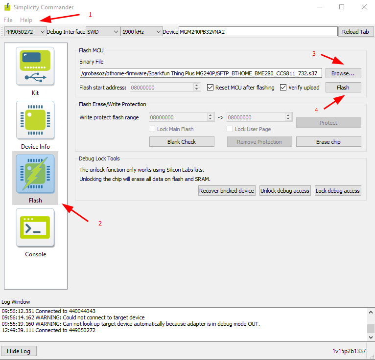
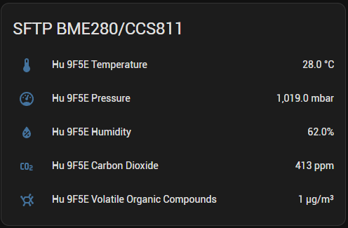
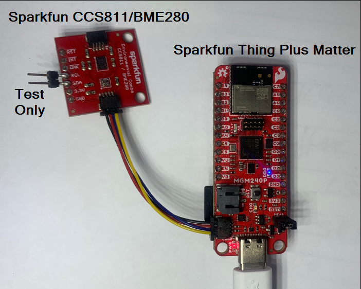

## Sparkfun Thing Plus Matter

**SFTP_BTHOME_BME280_CCS811_732.s37**

* SFTP - Sparkfun Thing Plus
* BTHOME - Bluetooth Home
* BME280 - BME280 support via Qiic connector
* CCS811 - CCS811 support via Qiic connector
* 732 - Silabs SDK V7.3.2

---

## Installation

Flash the firmware (.using the standard MGM240 programming tools, eg the Silabs **Commander.exe** application



1. Select Sparkfun Thing Plus Matter **Debug Interface** device.
2. Select **Flash**
3. **Browse** for the firmware.
4. **Flash** the device.

Once programmed the serial console can be checked for data from the Qiic devices using a standard serial program (eg [Hercules](https://www.hw-group.com/software/hercules-setup-utility)).

Console Response after Reset...
```
======== Application initialization =========
DRV:BME280,INIT
DRV:BME280,ADD=77,INI OK
DRV:CCS811,ADD=5B,INI OK
=============== Start measuring ===============
Temperature: 29.0 °C
Presure: 1019 mBar
Humidity: 62.0%
CO2: 413 ppm
TVOC: 1 ppb

```

In Home Assistant the BTHome device is detected and can be added to the dashboard.

<div style="text-align: center;">



</div>

---

###Note.

This is test firmware to check hardware and BTHome operation.

The Device Key is **11112222333344445555666677778888**

Updates are every 10s so not "low power friendly".

The units need to be changed in Home Assistant from ppb to ug/m3.
(If anyone knows how to do this please let me know!)



NB: Pins on SCL and SDA are not necessary - I use them for testing only.
